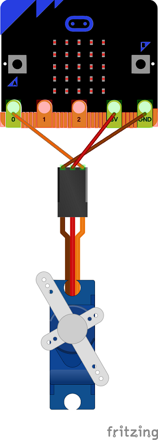

# Build a "High 5" Robotic Arm
In this project, you will be using the micro:bit and a servo to move a robotic arm. The micro:bit light sensor will trigger the servo, so that when a shadow of a hand passes over the LED array, the arm rotates into a "high 5" position.

### Step 1: Build the circuit
Our Robotic Arm project will use the following parts:
- Micro:bit
- Servo
- Alligator cables to connect the micro:bit to the servo
- Robotic arm (popsicle stick with hand cutout and servo mount)
-   

Use the following circuit diagram to construct connect the servo, micro: bit and alligator cables. 
   

### Step 2: Build the Robotic Arm
There may already be a popsicle stick arm in your kit. If not, you will need to make one. Ask your teacher for a print out of a hand and a glue gun. Cut out the hand and glue it to one end of the stick. Glue the servo mount from your kit to the **side** of the popsicle stick at the other end.     
   
Attach the robotic arm to the servo by pressing it into place.   
   
### Step 3: Test the circuit
Just like in the previous project, you can test the photoresitor of your circuit by using your hand to create a shadow over the photoresistor. A shadow should decrease the the value of the **Analog0 sensor**. You can display the value in a say block or just look at **Analog0** in the sensors display. 

To test the servo, drag a **Motor 8 angle** block from the Motion tab to Scripts. Click on the block with different values from 0 to 180 and verify that the arm rotates.    
 
### Step 4: Write the program
One possible solution might use:
- 1 *forever* loop block from the Control tab
- 1 *if else* block from the Control tab
- 1 *value of sensor Analog0* block from the Motion tab
- 2 *motor 8 angle* blocks from the Motion tab
- 1 *< (less than)* block from the Operators tab

### Step 5: Submit your finished program
Have your teacher or a TA verify that you have a working program. Submit your finished program by uploading the .sb file to Google classroom. You should be able to find it in *My Documents | Scratch Projects*. If you worked with a partner, each partner should submit a copy of the finished program to Google classroom.
